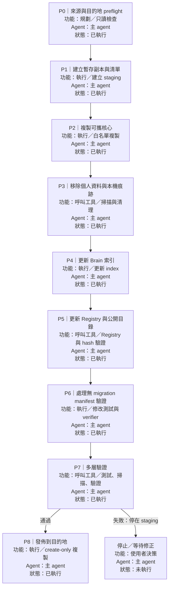

# 教育版工作區清理與複製計畫書

狀態：已完成／P0–P8 全部通過；乾淨副本已建立並完成落地驗證

## 1. 目標

從目前工作區建立一份可攜、可驗證、適合教育用途的乾淨副本。

執行時以 `$SOURCE_ROOT` 指向來源工作區，以 `$DESTINATION_ROOT` 指向使用者指定的目的地。這些路徑只存在於執行參數，不寫入 portable 設定或產出檔案。

## 2. 使用者指定的清理範圍

下列內容預設不進入乾淨副本：

- LINE 筆記及其索引、manifest、來源稽核與 mirror 內容。
- 工作紀錄：`brain/experience/`、`brain/error-log/`，以及人工審查後判定屬於個人工作脈絡的其他檔案。
- `brain/migration-manifest.json`。
- 本機設定：`harness/config/env.local.json`。
- 執行狀態：`harness/state/` 內的執行產物；只保留必要的空目錄標記。
- `.git/`、`.codex/`、`.agents/`、`.claude/`、`.vscode/`、`node_modules/`、暫存檔、快取、輸出物與個人專案資料。
- 絕對路徑、使用者名稱、個人帳號、來源 repository、內部代號、cookie、token、password、private key 與其他憑證資料。

## 3. 核心原則

1. 不修改 `$SOURCE_ROOT`；所有刪除與改寫只發生在暫存副本。
2. 採白名單複製。沒有明確列入保留範圍的內容，先排除或放入人工審查清單。
3. `$DESTINATION_ROOT` 若不是空目錄，或發現任何檔案衝突，立即停止，不自動覆寫。
4. 掃描採 fail-closed：發現一筆未判定的私人資訊就暫停發佈，不以「看起來像公開資料」代替確認。
5. 最終副本只保存可稽核的目標、假設、檢查結果與不確定性，不保存來源工作階段細節。

## 4. 執行拓樸圖

圖中 P0 的「已執行」只代表已完成來源與目的地的只讀盤點、基線測試及 Harness 驗證；清理、更新索引與複製仍尚未執行。

### 節點完成回寫、偏離回顧與中斷續接

每個 P 節點完成後，依序做以下動作，再進入下一個節點：

1. 把 Mermaid 圖中該節點的狀態更新為 `已執行`、`未執行` 或 `有問題`。
2. 在 checkpoint 紀錄實際結果、可稽核證據、是否偏離原計畫，以及下一個節點。
3. 比較實際的功能、依賴、allowed paths、agent 與 verifier mode；若有跑歪，先停在該節點並修正計畫或等待使用者決策。
4. 任務中斷後先讀取拓樸圖與最後一筆 checkpoint，從第一個尚未 `已執行` 的節點續接；若外部狀態已改變，先重跑 P0。

目前 checkpoint：

| 節點 | 狀態 | 實際結果／證據 | 偏離回顧 | 下一步 |
|---|---|---|---|---|
| P0 | 已執行 | 完成來源與目的地只讀盤點、基線測試及 Harness 驗證 | 未發現偏離 | P1 |
| P1 | 有問題 | staging 已建立，但第一次報告的路徑分類結果不合理 | Windows 路徑分隔符未正規化，排除項被誤列為 review | 修正分類器並重建報告 |
| P1 | 已執行 | staging 與 audit 報告已建立；760 個檔案分為 144 個 keep、29 個 review、587 個 exclude；報告路徑無絕對路徑且無重複 | 修正後符合白名單、人工審查與預設排除策略；正式目的地仍為空 | P2 |
| P2 | 有問題 | create-only preflight 發現 allowlist 中計畫書檔案的 bytes 與目前來源不一致 | P1 完成後回寫計畫狀態，導致 P1 allowlist 變成舊版本 | 刷新 allowlist／摘要後重做 preflight |
| P2 | 已執行 | allowlist 刷新後 preflight 通過；173 個候選檔案全部複製且逐檔 bytes 驗證通過；staging 無額外非 audit 檔案，正式目的地仍為空 | 修正 allowlist drift 後，實際 staging 與候選清單一致 | P3 |
| P3 | 有問題 | 初次去識別掃描仍命中 3 個通用絕對路徑文字；中性化也造成 2 個暫存檔語法問題 | 需在 staging 修正 README／migration 說明中的固定磁碟示例、測試中的路徑樣式，以及被中性化的物件鍵 | 重新掃描與語法驗證 |
| P3 | 已執行 | staging 移除 4 個私人／內部專用檔案；169 個保留檔案通過 JSON 解析、MJS 語法、私有識別／帳號／絕對路徑／憑證掃描；指定排除項 0 殘留；正式目的地仍為空 | 修正後功能仍符合 P3；`harness validate` 為 `ok`，但其輸出仍列出待 P4–P6 更新的邏輯路徑，未視為 P3 失敗 | P4 |
| P4 | 已執行 | 更新 `brain/index.json` 只保留實際存在的 `skills`、`knowledge`、`templates`；`brain inspect` 顯示 3 個 collection 均存在且無 warning；知識與導覽文件不再指向已移除鏡像 | 實際修改仍限於 staging 的 Brain 索引、導覽與 provenance；未擴張到正式目的地 | P5 |
| P5 | 已執行 | `harness validate` 為 `ok`；Registry 與 catalog 均對應現有 18 個 Skill，無未知或遺漏 ID；移除 Skill provenance；portable config 的 path／file keys 全部指向現存檔案 | 修改限於 Registry、catalog、CLI 摘要與 portable config；Skill package 未改寫，canonical hash 維持有效 | P6 |
| P6 | 有問題 | 無 manifest verifier 與新乾淨 Brain 測試已通過，但完整測試有 2 個 false positive：portable-path 正規表示式把 `https://` 誤判成磁碟路徑 | 問題在測試 pattern 的邊界，不是 staging 內容；需加入邊界判斷後重跑測試 | 修正測試 pattern |
| P6 | 已執行 | `npm --prefix staging test` 25/25 通過；`.mjs` 語法檢查通過；`brain verify` 回報 `not-applicable`、errors 為空；乾淨 Brain collection 可搜尋與讀取 | 加入 path 邊界條件後 false positive 消失；實際 runtime、測試與文件仍符合無 manifest／無 note library／無工作紀錄的目標 | P7 |
| P7 | 有問題 | 初次 allowlist 差異腳本誤讀 `relative_path` 欄位，並把預期排除路徑未經存在性檢查就列為命中 | 問題在審查腳本，不是 staging 或正式目的地；修正欄位與存在性判斷後重跑 | 重新執行差異審查 |
| P7 | 已執行 | 25/25 測試通過；Harness validate／blocks、Brain inspect 通過；Brain verify 為 `not-applicable` 且無 error；獨立私人資訊掃描 0 命中；169 個檔案全在 allowlist 內，P3 移除的 4 個為唯一缺項；正式目的地 0 檔 | 修正審查腳本後結果符合原定 verifier、allowed paths 與 fail-closed 要求；只保存 staging audit 摘要 | P8 |
| P8 | 有問題 | 第一次逐檔複製因目錄建立命令的 PowerShell 參數錯誤中止，目的地暫留 4 個根目錄檔案 | 4 個檔案逐檔 hash 與 staging 相同；未刪除或覆寫，修正命令後以 create-only 規則續接 | 驗證既有檔案後續接複製 |
| P8 | 已執行 | 目的地完成 169 個檔案；與 staging 的檔案數、bytes、逐檔 hash 全部一致；無 `_audit`、無排除項；目的地 `npm test` 25/25、Harness validate `ok`、Brain inspect `ok`、verify `not-applicable` 且 errors 為空 | 實際只新增與驗證同 hash 的控制檔；未使用刪除式同步，結果符合 create-only 與 P8 完成條件 | 完成 |

後續節點完成時，必須在此表新增一列，並同步更新上方拓樸圖；不能只修改表格或只修改圖表其中一處。

## 5. Route Plan

### P0｜來源與目的地 preflight

檢查：

- `$SOURCE_ROOT` 確實包含 `harness/config/local-harness.json`。
- `$DESTINATION_ROOT` 存在性、是否為空、是否含有 `.git` 或其他既有專案資料。
- 來源目前的基線測試與 Harness 驗證結果。
- 來源與目的地不相同，且沒有符號連結或路徑穿越。

停止條件：目的地非空、來源 marker 不符、或無法安全解析兩邊的絕對位置。

### P1｜建立暫存副本與清單

建立獨立 staging 目錄，產生兩份只供審查的資料：

- `allowlist`：預計保留的檔案與目錄。
- `exclusion report`：被排除的路徑、排除原因與是否需要人工覆核。

暫存報告不直接放入最終副本，避免報告本身暴露來源檔名、帳號或路徑。

### P2｜複製可攜核心

預設保留：

- 根目錄的 `README.md`、`AGENTS.md`、`package.json`、`.gitignore`。
- `harness/` 的核心 block、CLI、runtime、schema、測試與可攜文件。
- `brain/skills/`、`brain/templates/`。
- 經過內容審查且不含來源脈絡的 `brain/knowledge/`。
- `projects/`、`outputs/`、`workspace/` 的空目錄骨架（如仍需要）。

不直接複製整個 `brain/` 或 `references/`；各子目錄必須依本計畫逐項決定。

### P3｜移除個人資料與本機執行痕跡

執行以下處理：

- 移除 `references/line-notes/` 的 mirror、INDEX、tags、manifest、reconciliation 與 provenance。
- 移除 `brain/experience/`、`brain/error-log/`、`brain/migration-manifest.json`。
- 不複製 `harness/config/env.local.json`；清除任何 state、session、cookie、token 或 credential 檔案。
- 移除 editor、VCS、套件安裝、暫存與產出資料。
- 對保留的 Markdown、JSON、JSONL、MJS、PS1、YAML/YML 做內容掃描，將絕對路徑改為 repository-relative path，將來源帳號與內部代號改成中性描述，無法判定者排除。

### P4｜更新 Brain 索引

更新 `brain/index.json`，使它只描述實際存在且允許載入的內容：

- 移除已刪除的 migration manifest path。
- 移除 `note_library` collection 及其 `INDEX.md`、manifest、record index、mirror 等引用。
- 移除已刪除工作紀錄 collection；保留的 `knowledge` 必須只指向清理後仍存在的文件。
- 若保留 `instincts`，只放入已確認為通用安全規則的內容；個人化規則不進入副本。
- 確認所有 `paths`、collection 的 `path_key`、索引檔與 sync script 都是 repository-relative，而且目標檔案實際存在。
- 同步更新 `brain/wiki-index.md` 或其他 Brain 導覽文件，不能再宣稱已移除的筆記庫或工作紀錄存在。

### P5｜更新 Registry 與公開目錄

更新下列設定，避免 Registry 與實際檔案不一致：

- `harness/config/skill-registry.json`
  - 只保留乾淨副本中實際存在的 Skill。
  - 保留 stable ID、繁體中文顯示名稱、依賴、必要檔案與相對路徑。
  - 移除來源帳號、來源 repository、內部 workspace 名稱等 provenance；若欄位是 schema 必需，改成中性且不具識別性的值。
  - 任何 Skill 內容改寫後重新計算 `canonical_sha256`，不能沿用舊 hash。
  - 確認每個 `agents/openai.yaml` 的可見名稱仍與 Registry 一致。

- `harness/config/skill-migration-catalog.json`
  - 保留 `harness:validate` 所需的 schema 與必要集合欄位。
  - 移除來源 repository、帳號、內部代號與個人搬移紀錄。
  - 對不屬於教育版的集合使用空集合或移除；不得留下指向不存在 Skill 的項目。

- `harness/docs/skill-migration-catalog.md`、其他架構／搬移文件
  - 改寫為中性、可攜的公開說明，或在沒有教育用途時直接排除。
  - 清除絕對路徑、外部帳號、來源 repo URL 與內部命名空間。

### P6｜處理沒有 migration manifest 的驗證行為

因為乾淨副本刻意不保存 `brain/migration-manifest.json`，必須確認驗證器不會把「沒有遷移紀錄」誤判成資料損壞：

- 將 Brain migration verify 的無 manifest 狀態明確標為 `not-applicable` 或等價的非錯誤狀態。
- 補一個「無 migration manifest、無 note library、無工作紀錄」的測試案例。
- 保留一般 Brain index、Skill Registry 與 Route Plan 的正常驗證。

若這需要修改 runtime 或 CLI，修改也只能使用 repository-relative path，不能以本機目的地作為特例。

### P7｜多層驗證

在 staging 與最終目的地各做一次：

1. `npm test`。
2. `npm run harness:validate`。
3. `node harness/cli/harness.mjs blocks`。
4. `node harness/cli/brain.mjs inspect`。
5. Brain verify：確認結果為 `ok` 或明確的 `not-applicable`，不可有失效索引錯誤。
6. 以獨立掃描檢查絕對路徑、帳號、email、URL query secret、API key、授權標頭憑證、private key、cookie、password 與 session 殘留。
7. 檢查所有 Registry entry 的 Skill 目錄、必要檔案、hash 與繁體中文名稱。
8. 重新列出排除清單，確認 LINE 筆記、工作紀錄、migration manifest、local config、state 與暫存產物沒有進入目的地。

任一項失敗就停在 staging，不寫入正式目的地。

### P8｜發佈到目的地

只有 P7 全部通過後才執行：

- 再次確認目的地沒有檔案衝突。
- 以 create-only 方式複製 staging 內容；不使用會靜默覆寫的同步參數。
- 複製後重新計算檔案清單與 hash，與 staging 比對。
- 在目的地重新執行最小驗證，留下結果摘要；不把私人掃描原文放入副本。

## 6. 風險與處理

| 風險 | 處理方式 |
|---|---|
| 刪除資料後留下失效索引 | 先更新 `brain/index.json`、導覽文件與 Registry，再做驗證 |
| 公開資料仍帶有個人脈絡 | LINE 筆記與工作紀錄整批排除；知識文件逐檔審查 |
| 只掃秘密，漏掉帳號或內部代號 | 同時做秘密、PII、絕對路徑、來源識別與命名空間掃描 |
| Registry hash 過期 | 任何 Skill 改寫後重新計算 tree hash |
| 目的地已有檔案 | 非空或 hash 衝突時停止，不覆寫 |
| 驗證器依賴已移除 manifest | 將缺少 manifest 定義為 `not-applicable`，並加入測試 |

## 7. 完成條件

計畫只有在以下條件全部成立時才算完成：

- 來源工作區沒有被修改。
- 目的地只包含 allowlist 內的檔案。
- LINE 筆記、工作紀錄、migration manifest、local config、state 與本機產物不存在。
- `brain/index.json` 沒有指向不存在內容的 path、collection 或 index。
- Registry 與 Skill 實際目錄、必要檔案、hash、依賴及繁體中文名稱一致。
- 沒有絕對路徑、帳號資訊、來源 repository、內部代號或憑證殘留。
- 測試、Harness 驗證、Brain inspect 與最終掃描全部通過。
- 所有未決內容已列入人工審查清單，而不是默默帶入副本。

## 8. 執行後保留的紀錄

只保留以下可稽核摘要：

- 執行日期與工具版本。
- allowlist／exclusion 的檔案數量與 bytes 統計。
- 驗證命令與結果。
- 未決項目與使用者決定。

不保留來源絕對路徑、個人帳號、筆記內容、秘密值或完整掃描命中原文。
